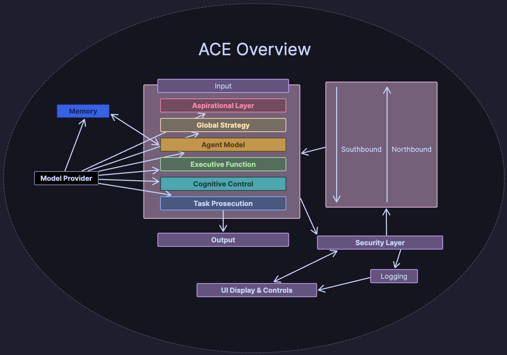

[⬆️](..)

# Requirements
- **Test Driven Development**
- Must be fully **containerised**
- Containers must have **resource limits**
- Must be be able to fit on less than **4gb ram**
- Every prompt and output should be less than **4k tokens**
- Must be **entirely local**
- Must have a **strong static typing and linting**
- Must be an **MVP**
- Must fulfil all the **basic requirements** of an [**ACE Framework**](https://github.com/daveshap/ACE_Framework)

# Technologies Used
## Language
- [**Python**](https://github.com/python/cpython) for backend
	- [**Pyright**](https://github.com/microsoft/pyright) for static type checking
	- [**Ruff**](https://github.com/astral-sh/ruff) for linting
	- [**Pydantic**](https://github.com/pydantic/pydantic) for data validation
    - [**PDM**](https://github.com/pdm-project/pdm) for package manager

## Communication
- [**NATS**](https://github.com/nats-io/nats-server) for queue management and messaging
- [**Fast-API**](https://github.com/tiangolo/fastapi) for apis

## Orchestration
- [**Podman**](https://github.com/containers/podman) for containerisation

## UI
- [**HTMX**](https://github.com/bigskysoftware/htmx) for server side rendering
	- [**Jinja**](https://github.com/pallets/jinja) for html templating
- [**DaisyUI**](https://github.com/saadeghi/daisyui) for components

## LLM
- [**Ollama**](https://github.com/ollama/ollama) for serving models
	- [**Phi-2-Orange**](https://huggingface.co/rhysjones/phi-2-orange) as the base model
- [**Guardrails**](https://github.com/guardrails-ai/guardrails) for output validation
- [**Open Interpreter**](https://github.com/KillianLucas/open-interpreter) for tool usage

### RAG
- [**LanceDB**](https://github.com/lancedb/lancedb) for memory
	- [**SPR**](https://github.com/daveshap/SparsePrimingRepresentations) for compression
    - [**FastEmbed**](https://github.com/qdrant/fastembed) for embedding

## Observability
- [**VictoriaMetrics**](https://github.com/VictoriaMetrics/VictoriaMetrics) for metrics, logs aggregation and storage
- [**Grafana**](https://github.com/grafana/grafana) for visualisation
- [**Fluent-bit**](https://github.com/fluent/fluent-bit) for logs & metrics collection and forwarding
? - [**PSUtil**](https://github.com/giampaolo/psutil) for program metrics
- [**Structlog**](https://github.com/hynek/structlog) for logging

## Storage
- [**Postgress**](https://github.com/postgres/postgres) for database
    - [**Peewee**](https://github.com/coleifer/peewee) for ORM
- [**Garnet**](https://github.com/microsoft/garnet) for caching

# System Design

## Core
## **Model Provider**
This will serve the llm models to each of the layers and security layer in future iterations
- **MVP**
    - Serve model inference over an api
    - Multiple specialest models
- **Future**
    - Scaling to larger models based on spec decisions
    - Kubernetes to allow multiple models running asynchronously

## **Layers**
LLM Layers
- **MVP**
    - LLM inference
    - Modular
    - Stop function
        - Can be passed one layer down
        - Option to pass several layers down
    - Compression through summarisation
    - Send commands downstream and inputs upstream
    - Conditional input types based on layer type
    - Output as JSON
- **Future**
    - Request more function
- ### Aspirational
    - High level guidance and alignment
- ### Global Strategy
    - Long term strategic roadmaps
- ### Agent Model
    - Self awareness, grounding the agent in its physical limitations
    - **MVP**
        - Memory interface
- ### Executive Function
    - Practical project roadmaps considering mission and limitations
- ### Cognitive Control
    - Task switcher
- ### Task Prosecution
    - The executor of the agent

## **Busses**
Acts as queuing and communication between the layers
- **MVP**
    - Queue system
- **Future**
    - Backpressure
    - Distributed messages
- ### Southbound
    - The control bus, sending down commands and directives
- ### Northbound
    - The reporting bus, letting higher layers know of state

## IO
## **Input**
All the sensory information of the machine
- **MVP**
    - System Telemetry
        - Hardware & Software Statistics
        - Metrics
    - Basic World State
        - Datetime
        - Basic Info From Internet (Should work fully offline though)
    - Stdout
    - File Access
    - User Input (Text)
    - Basic Memory
    - Task Observation
- **Future**
    - API Calls
    - Opened Internet Access
        - BASHR Loop for research
    - Complex Memory
        - Short Term
            - Summarised for details
        - Long Term
            - Through Sparse Priming Representations(SPR)
        - Factual
            - Fact Database
        - Episodic
    - Vision
    - Auditory
    - Other Sensors?

## **Output**
All the physical actions of the machine
- **MVP**
    - Function calling
        - Code
        - Files
    - Memory
    - AI Models
- **Future**
    - API calls
    - Motors
    - Audio
    - Imagery
    - 3D models

## **Logging**
System state and outputs throughout its lifecycle
- **MVP**
    - JSON Logger
    - Different log levels with verbosity toggles
    - Error Logs on each component
- **Future**
    - Centralisation
    - Dashboards

## ACE Controls
## **Security Layer**
Acts as the vetting layer, ensuring that all outputs are valid and safe
- **MVP**
    - Structure validation
    - Safety validation
    - Logging of outputs
    - User auth
        - Access control
- **Future**
    - Alignment checks

## **UI**
The way the user interacts with the ACE
- **MVP**
    - User inputs
    - Agent status and activations
    - Deep dive into outputs
- **Future**
    - Statistics